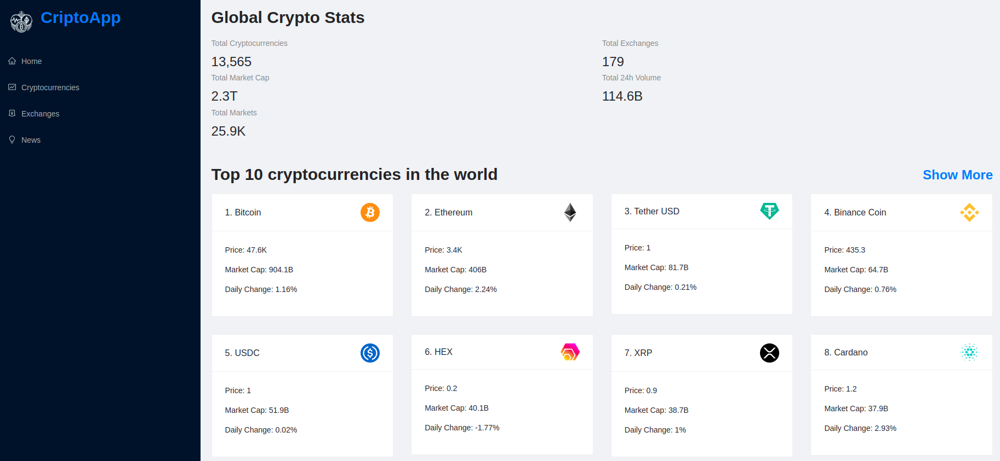

# CryptoApp
## this app was built as a personal project.

### The goal was to show data from different API's about: 
- cryptocurrencies 
- cryptomarkets 
- Crytonews 

### this application was built using: 
- React 
- Redux toolkit 
- Ant design to create the UI 
- Chart.js

### to fetch data the application uses the following two API'S from Rapid Api:

- [Coinranking api](https://rapidapi.com/Coinranking/api/coinranking1/)
- [Bing News Search](https://rapidapi.com/microsoft-azure-org-microsoft-cognitive-services/api/bing-news-search1/)

